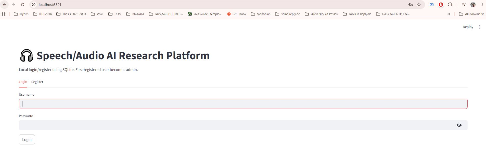
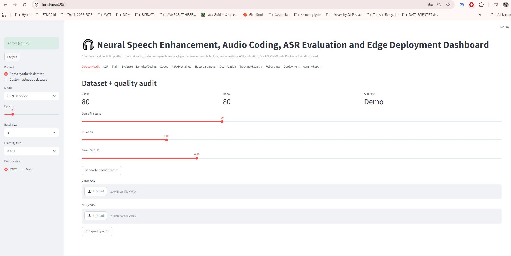
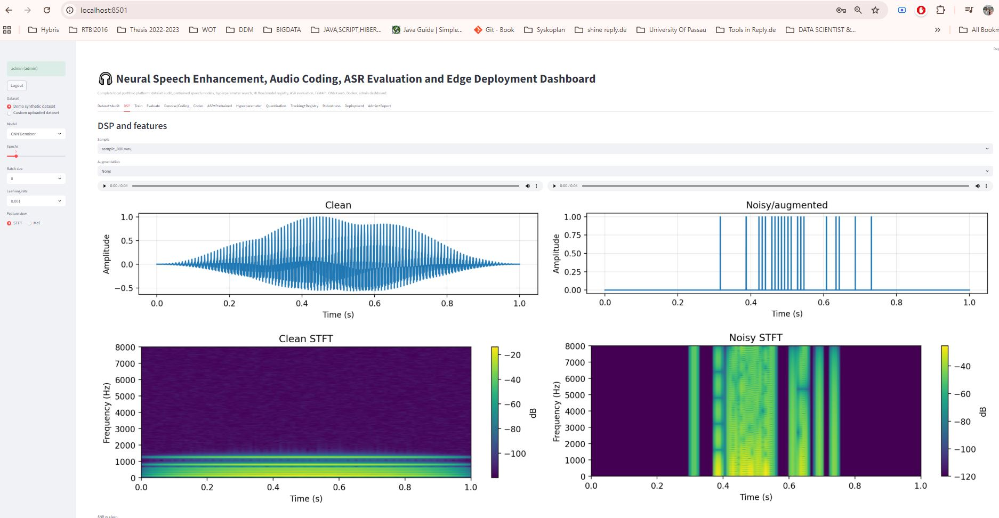
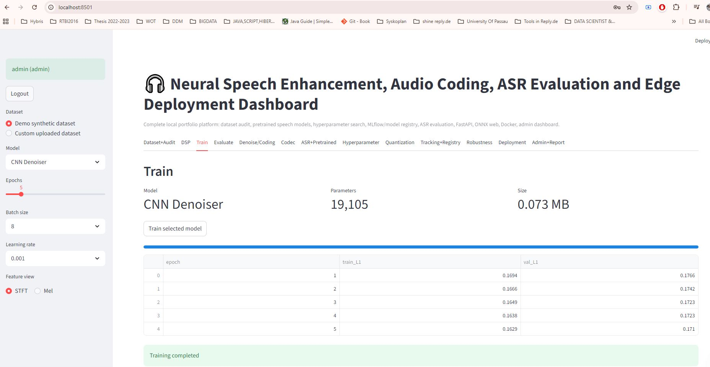

# Speech/Audio AI Research Platform Complete

Complete local Streamlit + PyTorch research-engineering portfolio project.

## Features
- SQLite register/login and admin dashboard
- Dataset generator, WAV upload, dataset quality audit
- STFT/Mel spectrograms and audio augmentation
- CNN/LSTM/Transformer denoisers and neural codec autoencoder
- SNR/SI-SNR/MSE plus optional PESQ/STOI
- ASR before/after denoising and Wav2Vec2 embeddings with optional Transformers
- Hyperparameter grid search
- Codec benchmark, ONNX export, INT8 quantization
- Microphone recording, robustness testing
- Local/MLflow tracking and model registry
- FastAPI backend, C++ demo, browser ONNX demo, Docker Compose

## Run
Double-click `run_streamlit_windows.bat`, register an account, generate demo data, train CNN Denoiser first.

Manual:
```bash
python -m venv .venv
.venv\Scripts\activate
pip install -r requirements.txt
streamlit run streamlit_app.py
```

Optional ASR/pretrained speech models:
```bash
pip install -r optional_requirements_research.txt
```

FastAPI:
```bash
uvicorn api.main:app --reload
```

## Screenshots

Outputs

<p align="center"></p>
<p align="center"></p>
<p align="center"></p>
<p align="center"></p>
<p align="center"></p>
<p align="center"></p>

MLflow:
```bash
mlflow ui --backend-store-uri ./mlruns
```
